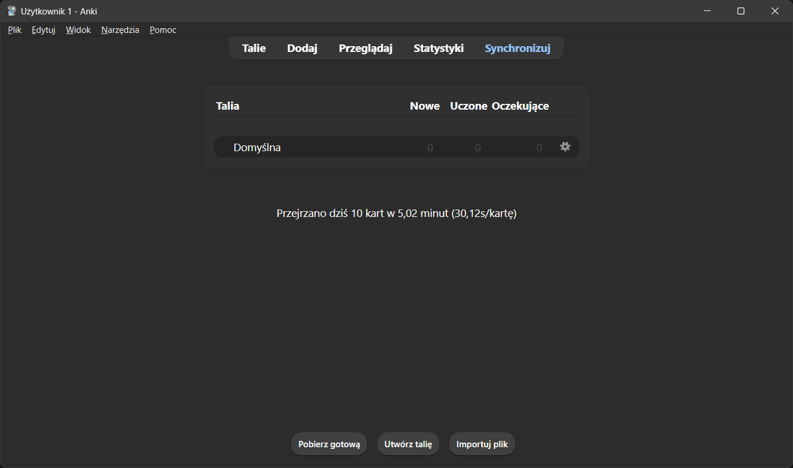

# Wprowadzenie do obsługi programu Anki

## Start!

1. Zainstaluj program ([https://apps.ankiweb.net/](https://apps.ankiweb.net/)).
2. Uruchom program.
3. Ustaw język programu.

## Rejestracja konta

> [!info] Czy potrzebujesz konta AnkiWeb do korzystania z Anki?
> Konto AnkiWeb nie jest konieczne do korzystania z programu Anki. Wszystkie funkcje, takie jak tworzenie, edycja i przeglądanie kart, są dostępne lokalnie, bez potrzeby rejestracji czy dostępu do Internetu.
>
> **Zalety korzystania z AnkiWeb:**
> - **Synchronizacja między urządzeniami:** Dzięki AnkiWeb możesz łatwo synchronizować swoje talie i postępy nauki między komputerem, telefonem i tabletem.
> - **Kopia zapasowa:** AnkiWeb automatycznie przechowuje Twoje dane w chmurze, co zabezpiecza je na wypadek awarii sprzętu.
> - **Dostęp przez przeglądarkę:** Możesz powtarzać swoje karty w dowolnym miejscu, korzystając z przeglądarki internetowej, nawet jeśli nie masz dostępu do urządzenia z zainstalowaną aplikacją.
>
> **Podsumowanie:**
> Jeśli używasz Anki tylko na jednym urządzeniu i regularnie tworzysz lokalne kopie zapasowe, konto AnkiWeb nie jest Ci potrzebne. Jeśli jednak chcesz synchronizować dane między urządzeniami lub mieć pewność, że Twoje talie są bezpieczne, warto je założyć.

1. Wejdź w menu **Narzędzia** na górze okna programu, następnie wybierz **Ustawienia → Synchronizacja** (skrót klawiszowy: **Alt+N** i **S**).
2. Kliknij przycisk **Zaloguj się**, a następnie przycisk **Zarejestruj konto** znajdujący się w tym samym oknie.
3. W formularzu rejestracyjnym wpisz swój adres e-mail i wymyśl hasło. Następnie kliknij przycisk **Zarejestruj**.
4. Przejdź do swojej skrzynki e-mail i znajdź wiadomość od Anki. Kliknij w link weryfikacyjny oznaczony jako **Verify**.
5. Po kliknięciu w link weryfikacyjny na stronie Anki kliknij przycisk **Proceed**, aby zakończyć proces.
6. Wróć do programu Anki, wpisz adres e-mail i hasło, a następnie kliknij przycisk **Zaloguj się** (skrót klawiszowy: **Tab** i **Enter**).
7. Po zalogowaniu program automatycznie uruchomi synchronizację. Możesz zobaczyć pasek postępu w prawym górnym rogu okna programu (skrót klawiszowy: **Y** do ręcznej synchronizacji). Możesz zobaczyć pasek postępu w prawym górnym rogu okna programu.

## Utwórz pierwszą talię 

> [!info] Co to jest talia kart w Anki?  
> **Talia kart** (ang. *deck*) to zbiór fiszek w programie Anki, które służą do nauki w systemie powtórek rozłożonych w czasie. Możesz organizować talie według tematów, przedmiotów lub innych kategorii, dostosowując je do swoich potrzeb edukacyjnych.

1. Kliknij przycisk **Utwórz talię** na dolnej belce głównego okna programu 
2. W wyświetlonym polu wpisz nazwę nowej talii (np. _Moja pierwsza talia_).![[Pasted image 20250104002143.png]]
3. Kliknij przycisk **OK**.

## Zmień nazwę talii

1. Najedź na utworzoną talię.
2. Kliknij ikonę **koła zębatego**.
3. Wybierz opcję **Zmień nazwę**.![[Pasted image 20250104002432.png]]
4. Wpisz nową nazwę talii (np. _Stolice świata_).![[Pasted image 20250104002503.png]]

## Dodawanie pierwszej notatki typu podstawowego

1. Kliknij przycisk **Dodaj** na górnej belce.
2. Ustaw typ notatki jako **Basic**, a talię jako tę talię, która przed momentem została utworzona.
3. Wpisz pytanie w polu **Front** (np. _Które miasto jest stolicą Francji?_).
4. Wpisz odpowiedź w polu **Back** (np. _Paryż_).
5. Kliknij przycisk **Dodaj** na dolnej belce lub naciśnij **Enter**.
6. Dodaj kolejną kartę, wpisując nowe pytanie i odpowiedź (np. _Którego państwa stolicą jest Paryż? Francji_).
7. Po dodaniu drugiej notatki kliknij przycisk **Zamknij** na dolnej belce.

## Przeglądanie swoich kart oraz ich edytowanie

1. W głównym oknie programu kliknij przycisk **Przeglądaj**.
2. Znajdź kartę z pytanień o stolicę Francji.
3. Zmień czcionkę, pogrubiając, podkreślając lub zmieniając kolor kluczowego słowa w pytaniu.
4. Zamknij okno przeglądania, wracając do głównego okna.

## Uczenie się nowych kart

1. Kliknij w stworzoną talię.
2. Kliknij przycisk **Ucz się teraz**.
3. Przeczytaj pytanie, pomyśl o odpowiedzi, a następnie kliknij przycisk **Pokaż odpowiedź** na dolnej belce.
4. Zwróć uwagę, że możesz wybrać, jak dobrze pamiętasz kartę.
5. Wybierz opcję **Dobra**.
6. Kontynuuj przeglądanie fiszek aż do uzyskania powiadomienia o zakończeniu powtórek.
7. Powróć do zakładki **Talie**.

## Tryb nauki własnej

1. Wejdź w talię, w której nie masz już zaplanowanych powtórek.
2. Kliknij przycisk **Nauka własna**.
3. Wybierz opcję **Nauka według stanu**, a następnie **Wszystkie karty w losowej kolejności (bez zmian planowania)**.
4. Nie wybieraj żadnych etykiet.
5. Zatwierdź wybór.
6. Kliknij przycisk **Ucz się teraz**.
7. Przejrzyj wszystkie notatki.
8. Na koniec usuń **Sesję nauki własnej**.

## Edytowanie kart podczas nauki

1. Podczas nauki kliknij przycisk **Edytuj** w lewym dolnym rogu okna nauki.
2. W nawiasie dodaj dodatkową informację, której brakowało.
3. Kontynuuj naukę.

## Dodawanie obrazu do fiszki

1. W głównym oknie programu kliknij przycisk **Przeglądaj** (skrót klawiszowy: **Ctrl+B**).
2. W lewym panelu wybierz talię, do której chcesz dodać obraz.
3. Znajdź notatkę w liście kart po prawej stronie i kliknij w nią, aby ją otworzyć.
4. W przeglądarce internetowej znajdź odpowiedni obraz, który chcesz dodać do fiszki.
5. Kliknij na obraz prawym przyciskiem myszki i wybierz opcję **Kopiuj obraz** (skrót klawiszowy: **Ctrl+C** w większości przeglądarek).
6. Wróć do programu Anki i w otwartym edytorze wklej obraz w polu pytania lub odpowiedzi (skrót klawiszowy **Ctrl+V**).
7. Kliknij na wklejony obraz, aby dostosować jego rozmiar lub położenie (np. wyrównanie do prawej strony).
8. Po zakończeniu edycji kliknij przycisk **Zamknij**, aby zapisać zmiany (skrót klawiszowy: **Ctrl+W**).
9. Zamknij przeglądarkę kart, klikając ikonę **X** lub korzystając ze skrótu klawiszowego **Ctrl+Q**.

## Dodawanie fiszki z dźwiękiem

1. Pobierz z Moodle plik z nagranym dźwiękiem.
2. Kliknij przycisk **Dodaj** na górnej belce głównego okna programu.
3. Wybierz typ fiszki **Basic** oraz odpowiednią talię.
4. Wpisz pytanie w pole **Front** (np. _Jakie patologiczne zjawiska osłuchowe słyszysz na tym nagraniu?_).
5. Kliknij przycisk **Spinacz**.
6. Wybierz plik z nagranym dźwiękiem.
7. Wpisz odpowiedź w pole **Back** (np. _Rzężenia drobnobańkowe_).
8. Kliknij przycisk **Dodaj**.
9. Zamknij okno dodawania fiszek.

## Dodawanie fiszki typu podstawowego z możliwością wpisania odpowiedzi

1. Kliknij przycisk **Dodaj** na górnej belce (skrót klawiszowy: **Ctrl+N**).
2. Wybierz typ notatki **Basic (type in the answer)** z listy rozwijanej typu notatek.
3. W polu **Front** wpisz pytanie, które wymaga wpisania odpowiedzi (np. _Który pierwiastek chemiczny ma symbol H?_).
4. W polu **Back** wpisz poprawną odpowiedź (np. _Wodór_).
5. Kliknij przycisk **Dodaj** na dolnej belce lub naciśnij **Enter**, aby zapisać fiszkę.
6. Kliknij przycisk **Zamknij**, aby zakończyć dodawanie fiszek.

## Dodawanie notatki typu uzupełnianie luk

1. Kliknij przycisk **Dodaj** w górnej belce głównego okna programu.
2. Jako typ notatki wybierz **Cloze**.
3. Wpisz tekst (np. _Stolicą Francji jest Paryż_).
4. Zaznacz słowo, które ma być zakryte podczas wyświetlania fiszki.
5. Kliknij przycisk **Dodaj lukę**.
6. Zaznacz kolejne słowo i dodaj kolejną lukę.
7. Kliknij przycisk **Dodaj** w dolnej belce okna.

## Dodawanie fiszki typu zamaskowanego obrazu

1. Pobierz plik PDF z fragmentem podręcznika do fizjologii.
2. Kliknij przycisk **Dodaj** w górnej belce głównego okna programu.
3. Jako typ notatki wybierz **Image Occlusion**.
4. Otwórz PDF z fragmentem podręcznika.
5. Otwórz narzędzie wycinania (możesz skorzystać ze skrótu klawiszowego **Win+Shift+S** w systemie Windows).
6. Zaznacz schemat z podręcznika.
7. Wróć do notatki w Anki i kliknij przycisk **Wklej obraz ze schowka**.
8. Zamaskuj podpisy umieszczone na schemacie.
9. Przejdź do tekstowej części fiszki, klikając ikonę z czterema prostokątami.
10. Wpisz treść pytania.
11. Dodaj dodatkowe informacje, które mogą nadać kontekst.
12. Kliknij przycisk **Dodaj**.
13. Zamknij okno dodawania fiszek.

## Synchronizacja swojej kolekcji

1. Kliknij przycisk **Synchronizuj**.
2. Jeśli pojawi się komunikat, wybierz opcję **Wysyłania z kopii lokalnej do chmurowej**.

# Współpraca podczas tworzenia kart

## Eksportowanie swojej talii kart
1. Uruchom program Anki 
2. Najedź na swoją talię kart
3. Kliknij przycisk koła zębatego
4. Wybierz Eksportuj
5. Upewnij się, że eksportujesz talię, a nie całą kolekcję 
6. Upewnij się, że eksportujesz talię razem z plikami (obrazami, dźwiękami itp.)
7. Kliknij Eksportuj i wybierz miejsce, w którym ma zostać zapisana wyeksportowana talia
8. Możesz przesłać wyeksportowaną talię koledze

## Importowanie otrzymanych talii
1. Pobierz talię z plików kursu ([Insulina_Example.apkg](Insulina_Example.apkg))
2. W głównym oknie programu na dolnej belce odnajdź i kliknij przycisk **Importuj plik**
3. Wybierz plik talii
4. Upewnij się, że nie importujesz talii razem z cudzymi opcjami powtórek
5. Kliknij przycisk Importuj
6. Uruchom przeglądarkę kart
7. Przejrzyj zaimportowane fiszki

## Ponowne importowanie talii ze zmianami
1. Pobierz kolejną talię z plików kursu ([Insulina_Example_2.apkg](Insulina_Example_2.apkg))
2. Zaimportuj ją, klikając podwójnie na plik w folderze
3. Upewnij się, że jest zaznaczona odpowiednia opcja aktualizacji zmodyfikowanych fiszek
4. Kliknij przycisk **Importuj**
5. Zwróć uwagę, że jedna fiszka została dodana, a jedna fiszka zmieniona

## Importowanie talii z Shared Decks
1. W głównym oknie programu kliknij przycisk **Pobierz gotową** na belce dolnej
2. Wyszukaj talie dotyczące fizjologii
3. Wybierz jedną z nich (np. [FIZJOLOGIA WUM KASIA](https://ankiweb.net/shared/info/2090870864))
4. Pobierz talię, klikając przycisk **Download**
5. Zaimportuj talię do swojej kolekcji

# Edytowanie opcji programu

## Dostosowanie podstawowych opcji powtórek

1. Najedź na talię.
2. Kliknij ikonę **Koła zębatego**.
3. Wejdź w **Opcje**.
4. Przejdź do sekcji **Nowe karty**.
5. Dostosuj kroki nauki (ang. learning steps). Sugerowane: 15m 1h 8h 1d 3d
6. Dostosuj przerwę dla kart po nauce. Sugerowane: 5d
7. Dostosuj przerwę dla łatwych. Sugerowane 7d
8. Kliknij przycisk **Zapisz**.

## Tworzenie presetu podstawowych opcji powtórek

1. Ponownie uruchom **Opcje talii**.
2. Rozwiń menu obok przycisku **Zapisz**.
3. Kliknij przycisk **Dodaj opcję**.
4. Wpisz nazwę presetu (np. _Gęsta_).
5. Ustaw gęstsze kroki nauki niż poprzednio. Sugerowane: 5m 15m 45m 90m 3h 8h 1d 3d → 5d, 7d
6. Kliknij przycisk **Zapisz**.
7. Zamknij okno **Opcji**, wracając do okna głównego.
